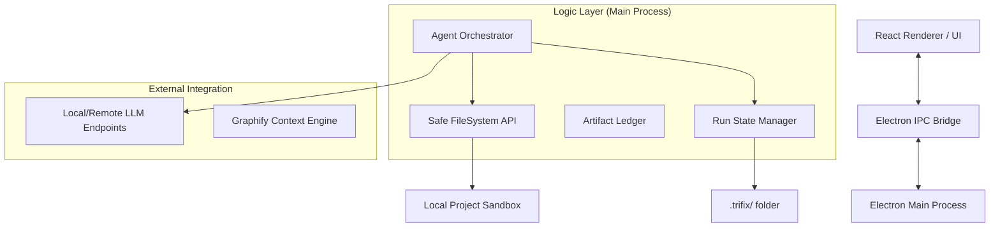

# System Architecture

TriFix AI is built on a split architecture between a secure Electron backend and a dynamic React frontend, orchestrated by a multi-agent logic layer.

## High-Level Architecture

## Component Breakdown

### 1. Agent Orchestrator (`electron/agent/orchestrator.js`)
The "brain" of the system. It manages the PM -> QA -> DEV pipeline, handles prompt construction, and manages parallel agent calls. It is responsible for parsing agent outputs into actionable file operations.

### 2. Safe FileSystem (`electron/fileSystem.js`)
A restricted wrapper around Node's `fs` module. It enforces:
- **Sandbox Isolation**: Work is primarily done in `Sandbox folder/` or `tasks/` subdirectories.
- **Blocked Directories**: Prevents access to `node_modules`, `.git`, `.env`, etc.
- **Allowed Extensions**: Only permits editing specific code and configuration files.
- **Size Limits**: Rejects files over 180 KB to maintain performance and stay within context limits.

### 3. Run State Manager (`electron/agent/runState.js`)
Handles the persistence of the autonomous loop. It manages the `.trifix/` directory which contains:
- `run-state.json`: Current status, attempt counts, and phase progress.
- `run-log.jsonl`: Detailed event log for debugging and reporting.
- `memory.md`: Persistent project memory across runs.

### 4. Artifact Ledger (`electron/agent/artifactLedger.js`)
Tracks the history of proposed vs. applied file changes and command requests. This provides the evidence for the "Validation and Repair" loop.

### 5. Context Layer (Graphify)
An optional integration that builds a knowledge graph of the project structure. It allows agents to query for "related files" or "routing implementations" without scanning the whole tree.
